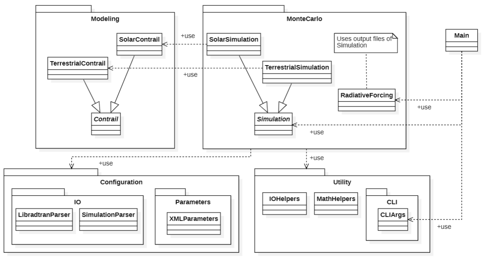

# RF-Contrails

This project aims to simulate the transfer of radiation through a condensation trail in the atmosphere. Subsequently, the output can be combined with [Libradtran](https://www.libradtran.org) to compute the radiative forcing of the simulated contrail. In the following section, a brief description of the simulation and radiative forcing calculations are given. The usage of the program is described in [this section](#usage).

The code is part of a PhD thesis, which can be found [here](http://dx.doi.org/10.13140/RG.2.2.34522.75206) for more detailed descriptions and explanations of concrete formulas of the model.

## Simulation of radiation

The simulation part of the project conducts a [Monte Carlo simulation](https://en.wikipedia.org/wiki/Monte_Carlo_method), which simulates interaction of a configurable number of photons with the contrail. The resulting data can then be used to calculate radiative forcing, which requires solving integrals along the paths of photons. To simulate the radiative transfer, the underlying model distinguishes between radiation coming from below - terrestrial radiation and radiation coming from above - solar radiation. While terrestrial radiation is modeled as diffuse, solar radiation contains a direct part of direct sunlight as well as a diffuse part, which accounts for radiation that was already scattered in the atmosphere. Each part is computed separately and output to a CSV-like file with additional comments to store the used simulation parameters. As a result of interaction with the contrail, photons can be absorbed or scattered, but they can also pass through it without any interaction (this is also referred to as transfer). Most importantly, output files contain the number of photons absorbed, scattered and transferred per direction. 

The Parameters for both simulation and contrail model can be specified in an XML configuration file, which is explained in [the following section](#configuring-the-simulation).

## Configuring the simulation

An exemplary configuration can be found in `config/example_config.xml`. A valid configuration file contains all parameters within the root tag `parameters`. Furthermore, all available configuration options are grouped by the part of the simulation they are valid for:

- `common` for parameters consistent across all parts of the simulation
- `solar_diffuse` for parameters of the simulation of diffuse solar radiation
- `solar_direct` for parameters of the simulation of direct solar radiation
- `terrestrial_diffuse` for parameters of the simulation of diffuse terrestrial radiation

In the following, brief descriptions of the parameters are given. For more detail, please refer to explanations of physical parameters given in the [thesis](http://dx.doi.org/10.13140/RG.2.2.34522.75206).

### Common parameters

- `out_file_prefix` specifies the prefix all output files that use this configuration will have in their name.
- `num_photons` specifies the number of photons that are evaluated in each direction of the simulation. It is recommended to simulate with at least one million photons per direction.
- `psi` The azimuth angle specifying the heading of the aircraft. This is used to apply a directional correction during the calculation of radiative forcing.

### Diffuse simulation parameters

- `num_sca` Number of classes of the scattering phase function
- `num_ice` Number of ice crystals in the contrail
- `distance` Length of the contrail
- `bins_phi` Number of bins (steps in direction) evaluated in the azimuthal plane. The azimuthal plane spans a full 360° plane, in which the contrail streams are positioned. Phi is the name of the directional coordinate in this plane.
- `bins_theta` Number of bins (steps in direction) evaluated in the upwards direction (zenith, with angles theta). 
- `resolution_s` Specifies the spatial resolution of the simulation. The supplied number needs to be an integer divisor of 180.
- `spectral_band_index` Specifies the index of the spectral band used for simulation. Spectral bands are defined by a certain wavelength and influence a number of other parameters of the simulation. Therefore, they are read from additional CSV-like parameter files located in the `Parameter` directory, which can contain multiple tables with spectral band parameters in each line. The index corresponds to the n-th row of data (not counting comments and table headers) in each table.
- `radius_incident` The radius of a surrounding cylinder around droplets/ice crystals.
- `radius_droplet` The radius of droplets in the contrail.
- `sigma_h`, `sigma_v`, `sigma_s` Special properties defined by the physical model of the contrail, dependent on the part of radiation and partly dependent on each other. For details on how to specify them please refer to the [thesis](http://dx.doi.org/10.13140/RG.2.2.34522.75206). Note that `sigma_s` is always zero for the terrestrial part and therefore does not have to be defined there.

### Direct solar simulation parameters

- `sza` Specifies the solar zenith angle (corresponds to the directional coordinate theta in the diffuse part). In this part of the simulation, only a single direction is evaluated in contrary to the diffuse part, therefore, there are no bins per coordinate axis and only a single direction is evaluated.
- `phi0` Specifies the azimuth direction of incoming direct radiation (corresponding to phi in the diffuse part).

The `solar_direct` part internally uses the physical contrail parameters specified by the `solar_diffuse` part for consistency.

### Simulation output

The simulation output is formatted in a custom CSV-like format and contains a series of comments denoted by `//` which contain the simulation input parameters, followed by a named CSV table (with spaces as value delimiters). Note that `lambda` specifically is given in micrometers instead of nanometers here. For the diffuse parts of the simulation, the CSV table contains the results of one direction (uniquely identified by the combination of `theta` and `phi`) per row. It contains the following columns:

- `theta` Zenith (height) coordinate of the incoming direction of radiation in radians
- `phi` Azimuth (contrail plane) coordinate of the incoming direction of radiation in radians
- `num_abs` Number of absorbed photons
- `num_scattered` Number of scattered photons
- `num_scattered_up` Number of upward scattered photons
- `num_scattered_down` Number of downward scattered photons
- `correction_factor` Directional correction factor to be multiplied to absolute numbers of scattered and absorbed photons in radiative forcing calculation
- `average_scattered` Average number of scattering events of a scattered photon
- `num_affected` Number of affected (absorbed or scattered, NOT transferred) photons. Equal to the total number of photons per direction minus the number of transferred photons.
- `S_<NUM>` where `<NUM>` is a number. According to the spatial resolution parameter `resolution_s`, $\frac{180}{\text{resolution}_s}$ bins are used to collect scattered photons, and for each bin, there is one corresponding column. The values in these columns are floating point numbers instead of absolute values, which can be less than 1, as `correction_factor` is already applied to them.

The output for the direct part of solar radiation only contains a single direction given by `sza` and `phi0` instead of `theta` and `phi`, respectively. It does not collect the scattered photons in bins, so there are no `S_<NUM>` columns.

## Radiative forcing calculation

[Radiative Forcing](https://en.wikipedia.org/wiki/Radiative_forcing) is a measure of energy balance in the atmosphere. In the context of this project, it represents the net influence of a condensation trail on the atmosphere. This effect can either be zero (neutral), negative (cooling) or positive (warming). The total radiative forcing of a contrail is computed as the sum of the solar and terrestrial contributions. To compute it, the results of the simulation as well as radiances given by [Libradtran](https://www.libradtran.org/doku.php) are required as inputs. The computations are done per wavelength of the supplied inputs and then integrated over all wavelengths to obtain the total radiative forcing. This and all intermediate results are written to a CSV output file `radiative_forcing.csv` in the input folder, which contains a table with one row per intermediate result and a final row with the total integrated results. Each row can be uniquely identified by the associated wavelength `lambda` and part of the simulation `part`. Values in the columns have the following semantics:

- `lambda` Specifies the wavelength of radiation of the computed part in nanometers. For the final row with the total result, this is zero, as all wavelengths are integrated.
- `part` Specifies the part for which the (intermediate) result was computed: `sol_dir` for the direct part of solar radiation, `sol_diff` for the diffuse part of solar radiation or `terr_diff` for the diffuse part of terrestrial radiation. For each wavelength, there are three rows, each containing one of the parts. In the final row, `total` is used to indicate that the values are integrated over all wavelengths. 
- `p_up` The total power of upward scattered photons in the same unit as specified in the Libradtran output files.
- `p_down` The total power of downward scattered photons in the same unit as specified in the Libradtran output files.
- `p_abs` The total power of absorbed photons in in the same unit as specified in the Libradtran output files.
- `rf_sol` The radiative forcing of the solar part. This is only computed in the `sol_diff` row, as it includes the results of the `sol_dir` part. In the `total` row, `rf_sol` values of all wavelengths are integrated.
- `rf_terr` The radiative forcing of the terrestrial part. This is only computed in the `terr_diff` row. In the `total` row, `rf_terr` values of all wavelengths are integrated.
- `rf_total`: Computes the total radiative forcing as a sum of solar and terrestrial parts: $RF_{\text{total}} = RF_{\text{sol}} + RF_{\text{terr}}$.

## Building

To build the project, run `mvn compile`. A portable executable jar file with all dependencies can be generated with `mvn package`.

## Usage

To run the simulation, execute `src/main/java/de/tudresden/aerospace/contrails/Main` from the command line after compiling. The command-line interface allows for the selection of the part to run: simulation or radiative forcing calculation based on simulation results. Based on the selected part, there are further sub-options.

- Use `-p <ID>` or `--part <ID>` options to specify the part to run. `<ID>` has to be one of `sol`, `terr` or `both` for computing the solar, terrestrial or both parts of the simulation. When set to `rf`, the radiative forcing is calculated instead. This option is required.

### Simulation sub-options

- Use `-t <NUM>` or `--threads <NUM>` to specify the number of threads the diffuse simulation should be computed in parallel with. This is optional and if omitted, the number of logical processors in the system is used.
- Use `-c <FILE>` or `--config <FILE>` to specify the name of the configuration file (in the `config` folder) to use. This option is required.
- Use `-f` or `--force` to force overwriting of existing output files in the output directory. This is optional and by default, a CLI prompt is given to keep or overwrite the files.
- Use `-m` or `--metrics` to write simulation metrics to a file inside the `metrics` folder. This is optional and by default, metrics are computed and printed to stdout but not written to a file.

### Radiative forcing calculation sub-options

- Use `-d` or `--directory` Specifies the path to the directory which contains simulation output files. There must be at least one output file for each part - solar diffuse, solar direct and terrestrial diffuse. Multiple files with different spectral band indices or wavelengths can be supplied in order to integrate the results, as long as the numbers of output files of each part are equal. This option is required.
- Use `-u <FILE>` or `--libradtran-uvspec <FILE>` Specifies the path to the Libradtran UVSpec solver output file, which contains solar wavelength radiances for all wavelengths of the simulation output files. This option is required.
- Use `-t <FILE>` or `--libradtran-twostr <FILE>` Specifies the path to the Libradtran TwoStream solver output file, which contains terrestrial wavelength radiances for all wavelengths of the simulation output files. This option is required.

## Developer Information

The following image shows an overview over the packages and most important classes of this application:

The application classes are semantically grouped into packages:

- `Configuration` houses I/O and management code
- `Modeling` contains classes related to the contrail model
- `MonteCarlo` contains classes related to the simulation and RF calculation
- `Utility` contains command-line argument parsing code as well as helper classes and functions related to I/O and data structures

All classes have associated [JavaDoc](https://docs.oracle.com/javase/8/docs/technotes/tools/windows/javadoc.html) for more information on variables, methods, etc.

Test code is located in `src/test/java` and contains two main test suites: `RFContrailsTestSuiteFull` and `RFContrailsTestSuiteCached`. The former executes all tests including simulation tests that execute the simulation and will take longer, whereas the latter will only run tests that do not execute the simulation for testing code that is unrelated to the simulation quickly.
